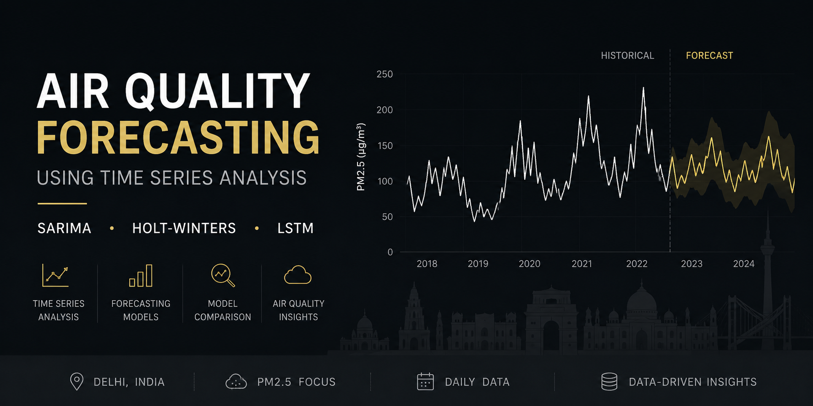
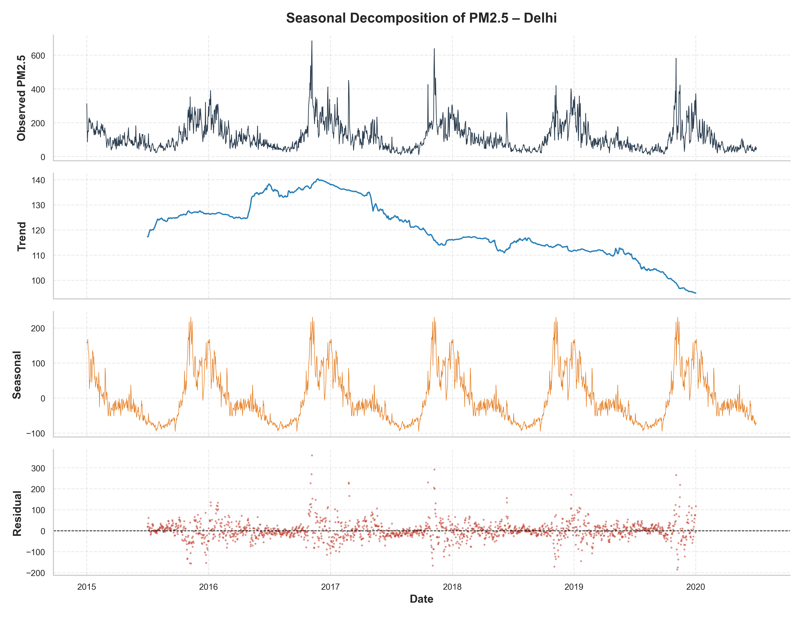
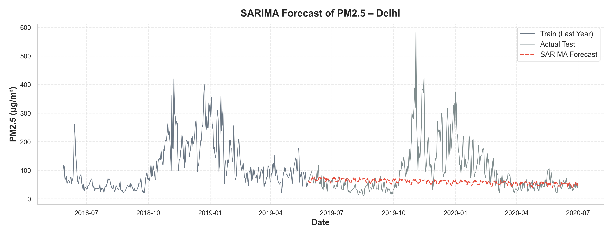
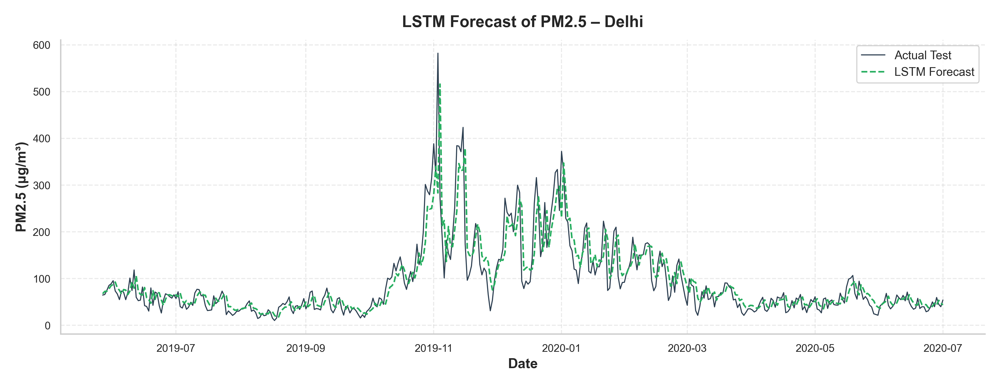
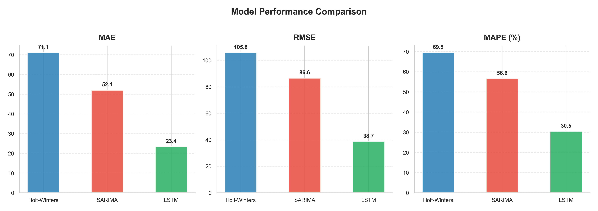
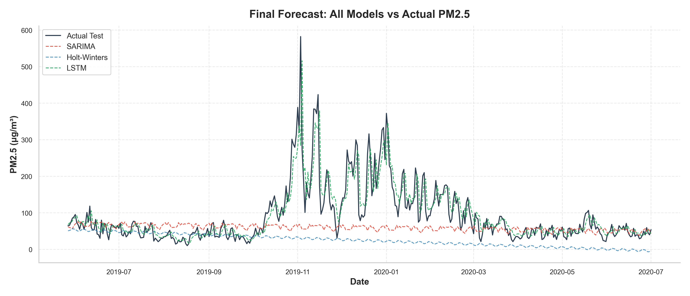

# Air Quality Forecasting using Time Series Analysis



## 📌 Project Overview

Forecasting PM2.5 air pollution levels in Delhi using three time series approaches — **Holt-Winters**, **SARIMA**, and **LSTM** — and comparing their accuracy on 5+ years of daily data.

Delhi consistently ranks among the world's most polluted cities. Accurate PM2.5 forecasting enables public health alerts, helps policymakers trigger interventions (traffic restrictions, construction bans), and supports smart city planning.

---

## 📊 Dataset

| Detail | Value |
|---|---|
| **Source** | Central Pollution Control Board (CPCB), India |
| **Target Variable** | PM2.5 concentration (μg/m³) |
| **Granularity** | Daily |
| **Period** | January 2015 – July 2020 |
| **Preprocessing** | Time-based interpolation, forward/backward fill |

---

## 🛠️ Methodology

```
Data Collection → Data Cleaning → Stationarity Testing → Seasonal Decomposition
→ Train-Test Split (80/20) → Model Training → Forecast Evaluation → Model Comparison
```

**Analysis Steps:**
- **ADF Test**: Verified stationarity (p-value = 0.0015). Despite statistical stationarity, seasonal differencing was applied due to strong annual cycles.
- **Seasonal Decomposition**: Isolated yearly trend, seasonal, and residual components (365-day period).

**Models Trained:**
- **Holt-Winters**: Additive trend + additive weekly seasonality (period = 7).
- **SARIMA**: Parameters `(2,1,2)×(0,1,1)[30]` with seasonal differencing.
- **LSTM**: 30-day sliding window, 50-unit LSTM layer, Adam optimizer, early stopping.

---

## 📈 Model Performance Comparison

| Model | MAE | RMSE | MAPE (%) |
|---|---|---|---|
| Holt-Winters | 70.55 | 105.36 | 68.68 |
| SARIMA (m=30) | 52.06 | 86.58 | 56.64 |
| **LSTM** | **23.50** | **38.91** | **29.04** |

**Interpretation**: LSTM outperformed both statistical models by a significant margin, achieving ~55% lower MAE and ~55% lower RMSE than SARIMA. The deep learning model's ability to learn non-linear patterns from sequential windows gave it a clear advantage on this high-variance dataset. SARIMA performed moderately well, while Holt-Winters struggled with the long-horizon forecast due to its reliance on local smoothing.

---

## 🔍 Key Findings

- **LSTM delivered the best performance** across all three metrics (MAE: 23.50, RMSE: 38.91, MAPE: 29.04%), confirming that neural sequence models handle volatile environmental data well.
- **Delhi's PM2.5 shows strong annual seasonality** — pollution peaks sharply during winter months (October–January) driven by crop stubble burning, low wind speeds, and temperature inversions.
- **Statistical stationarity ≠ visual stationarity** — the ADF test returned p = 0.0015, yet the series exhibited clear non-stationary behavior visually, reinforcing the need for seasonal differencing in SARIMA.
- **Holt-Winters is insufficient for long-horizon air quality forecasting** — its weekly seasonality assumption fails to capture the annual cycle, leading to the highest error rates.
- **SARIMA captures the seasonal envelope** but underestimates extreme pollution spikes, producing conservative forecasts during peak winter events.

---

## 🖼️ Visual Results

### Seasonal Decomposition


### SARIMA Forecast


### LSTM Forecast


### Model Comparison (Metrics)


### Final Forecast Overlay


---

## 📁 Repository Structure

```
Air-Quality-Forecasting/
├── data/
│   └── delhi_pm25.csv               # Cleaned Delhi PM2.5 time series
├── notebooks/
│   └── Air_Quality_Forecasting.ipynb # Analysis notebook
├── images/                           # Exported visualizations
├── README.md
├── requirements.txt
├── LICENSE
└── .gitignore
```

---

## ⚙️ Setup & Usage

```bash
# Clone
git clone https://github.com/yourusername/Air-Quality-Forecasting.git
cd Air-Quality-Forecasting

# Create virtual environment
python3 -m venv .venv
source .venv/bin/activate

# Install dependencies
pip install -r requirements.txt

# Run the notebook
jupyter notebook notebooks/Air_Quality_Forecasting.ipynb
```

---

## 🔮 Future Improvements

- Incorporate meteorological features (wind speed, temperature, humidity) for multivariate forecasting.
- Experiment with hybrid SARIMA-LSTM architectures for residual correction.
- Evaluate modern Transformer-based models (Informer, PatchTST) and Facebook Prophet.

---

## 👨‍💻 Author

**Shubham Sharma**
